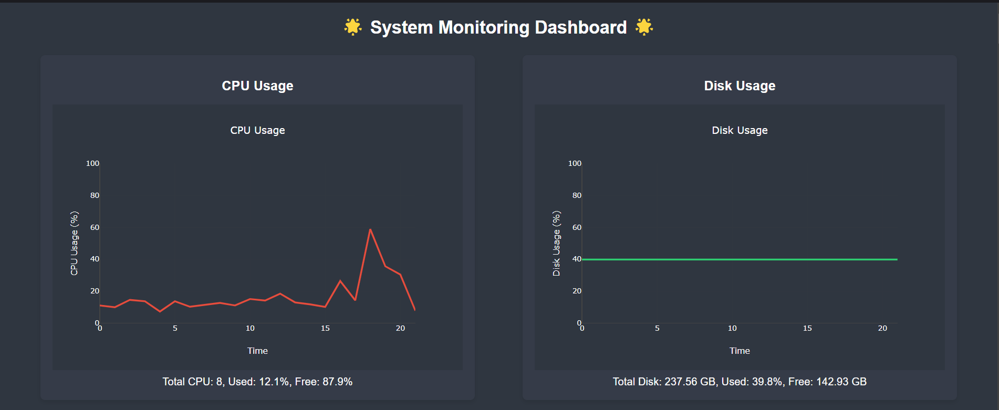
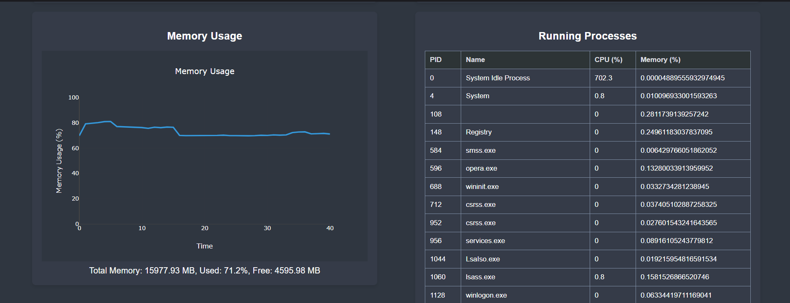

# FlaskAlert Monitor Deployment Guide


This README provides instructions for deploying the FlaskAlert Monitor application using two approaches: Docker container locally and Kubernetes cluster.

### Prerequisites
- Docker installed on your local machine
- AWS account
- AWS CLI installed and configured
- Python 3 installed

## 1. Docker Container Deployment (Local)

### Steps

1. Clone the repository:
   ```
   git clone <repository-url>
   cd flaskalert-monitor
   ```

2. Install dependencies:
   ```
   pip install -r requirements.txt
   ```

3. Build the Docker image:
   ```
   docker build -t flaskalert-monitor:latest .
   ```

4. Run the Docker container:
   ```
   docker run -d -p 5000:5000 --name flaskalert-monitor flaskalert-monitor:latest
   ```

4. Access the application:
   Open your web browser and navigate to `http://localhost:5000`

## 2. Kubernetes Cluster Deployment

### Prerequisites
- Kubernetes cluster set up (e.g., minikube, AWS EKS)
- kubectl configured to communicate with your cluster

### Steps

1. Clone the repository:
   ```
   git clone <repository-url>
   cd flaskalert-monitor
   ```

2. Create an ECR repository (if using AWS):
   ```
   python AWS-ECR.py
   ```

3. Build and push the Docker image to ECR:
   ```
   docker build -t <ecr-repository-uri>:latest .
   docker push <ecr-repository-uri>:latest
   ```

4. Deploy the application to Kubernetes:
   ```
   python AWS-EKS.py
   ```

5. Get the external IP or LoadBalancer URL:
   ```
   kubectl get services flaskalert-monitor-service
   ```

6. Access the application:
   Open your web browser and navigate to the external IP or LoadBalancer URL on port 5000.

7. Run the deployment script:
   ```
   python3 AWS-EKS.py
   ```
   This will create the deployment and service in your Kubernetes cluster.

8. Verify the deployment:
   ```
   kubectl get deployment -n default
   kubectl get service -n default
   kubectl get pods -n default
   ```
   These commands will show you the status of your deployments, services, and pods respectively.

9. Once your pod is up and running, expose the service using port-forward:
   ```
   kubectl port-forward service/flaskalert-monitor-service 5000:5000
   ```
   This command will make your service accessible on localhost:5000.

10. Access the application:
    Open your web browser and navigate to `http://localhost:5000`


## Approach using Jenkinsfile

1. Ensure Jenkins is set up with necessary plugins (Docker, Kubernetes, SonarQube, etc.).

2. Create a new Jenkins pipeline job and configure it to use the Jenkinsfile from your repository.

3. Set up the required credentials in Jenkins:
   - DockerHub credentials
   - SonarQube token
   - AWS credentials (if using AWS services)

4. Trigger the Jenkins pipeline:
   - It will automatically clone the repository
   - Run SonarQube analysis
   - Perform OWASP dependency check
   - Run Trivy file scan
   - Build and push Docker image
   - Deploy to Kubernetes

5. Monitor the Jenkins pipeline execution:
   - Review the console output for each stage
   - Check the SonarQube results
   - Verify the Docker image in your registry
   - Confirm the Kubernetes deployment

6. Once the pipeline completes successfully, your application should be deployed and accessible.

7. Access the application:
   - Get the external IP or LoadBalancer URL:
     ```
     kubectl get services flaskalert-monitor-service
     ```
   - Open your web browser and navigate to the external IP or LoadBalancer URL on port 5000.

This approach automates the entire process from code analysis to deployment, making it easier to maintain consistent deployments and quality checks.


## Monitoring and Maintenance

- To view logs: `kubectl logs deployment/flaskalert-monitor`
- To scale the deployment: `kubectl scale deployment/flaskalert-monitor --replicas=3`
- To update the application: Update the image in the deployment and apply the changes

For more detailed information on Kubernetes operations, refer to the official Kubernetes documentation.
